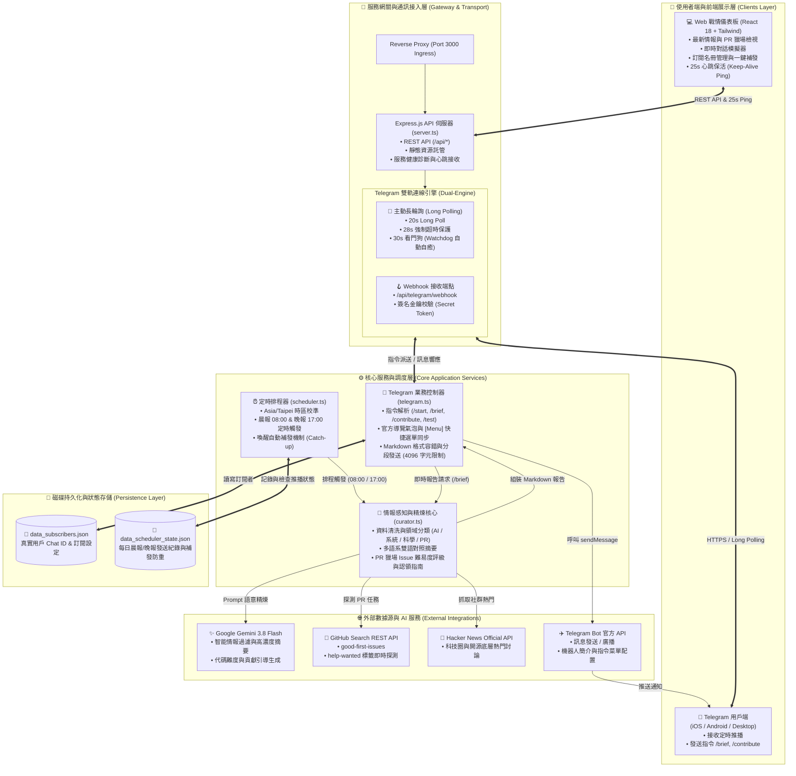

# ⚡ OpenPulse — 開源前沿情報與 PR 獵場 Telegram 機器人

> **OpenPulse** 是一款專為軟體工程師、開源貢獻者與前沿科研人員打造的自動化情報推播機器人與 Web 戰情儀表板。  
> 每日固定於 **早上 08:00** 與 **下午 17:00**（Asia/Taipei 時間），主動探測全球開源生態、學術預印本與系統底層突破，為你精選並生成高濃度技術快訊，更提供獨家 **「開源 PR 獵場 (Good First Issue)」** 引導社群認領貢獻！

---

## 🚀 核心功能與特色

### 1. ⏰ 雙時段定時精煉推播
* **晨間 08:00 晨讀報**：提煉昨夜全球開源重大發布、arXiv / Hugging Face 機器學習架構突破與社群高熱度討論。
* **傍晚 17:00 下班速遞**：收錄當日底層架構改進、Rust/C++/Go 生態動態，以及值得在下班或週末認領的開源 Issue。

### 2. 🌐 四大前沿情報維度
| 維度 | 涵蓋範疇 | 資料源與感知對象 |
| :--- | :--- | :--- |
| 🤖 **AI 前沿研究** | 推理模型 (Reasoning)、MoE、推論加速 (vLLM, Triton, SGLang)、微調量化 | arXiv, Hugging Face Daily Papers, 頂級實驗室 |
| 💻 **系統與基礎設施** | 高效能分散式、資料庫引擎 (DuckDB, ClickHouse)、編譯器、Linux 核心 | Hacker News API, GitHub Releases, 系統架構會議 |
| 🔬 **跨學科計算科學** | 蛋白質分子結構預測 (AlphaFold 3)、量子模擬 (Qiskit)、生醫演算法 | Nature Computational, bioRxiv, 科研開源庫 |
| 🛠️ **【獨家】PR 獵場** | `good first issue`、`help wanted`、單元測試、文檔健全、性能重構 | GitHub Search API 即時過濾，附具體上手建議 |

### 3. 💬 Telegram 機器人即時交互指令
* `/start`：啟動機器人並接收完整互動式引導氣泡與快捷按鈕。
* `/brief`：即時透過 Google Gemini 3.8 Flash 與開放 API 感知當前最新科技情報。
* `/contribute`：專門檢視近期熱門專案急需社群協助的 Issue 與 PR 任務。
* `/subscribe`：加入定時廣播清單，享受每日 08:00 與 17:00 免費自動推送。
* `/unsubscribe`：隨時取消定時廣播。
* `/topics`：自訂偏好技術領域（AI、系統、科學或 PR）。
* `/status`：檢視機器人運行狀態、下次推播時間與訂閱者統計。
* `/help`：查看指令使用手冊。

### 4. 🔄 雙軌即時連線引擎 (Long Polling + Webhook 備援)
* **主動長輪詢 (Long Polling)**：伺服器主動連向 Telegram 官方伺服器拉取最新消息，**無需公開 IP、不受 Google Cloud Run 登入驗證阻擋**，保證秒級收發！
* **Webhook 備援**：支援標準 HTTPS Webhook，便於在具備獨立公開網域時切換使用。
* **Markdown 智慧容錯機制**：當開源專案名稱中含有底線或中括號時，自動容錯並降級純文字與分段，確保訊息 100% 準確送達。

---

## 💬 Telegram 機器人視覺引導氣泡 (Greeting & Bubbles)

為了讓使用者一進到機器人對話框就知道怎麼使用，本專案完整支援 Telegram 官方的四大視覺氣泡機制：

### ① 空對話框「What can this bot do?」介紹氣泡 (Chat Description)
當使用者第一次透過連結（如 `t.me/YourBot`）打開機器人時，在尚未點擊「Start」前，Telegram 聊天室中央會展示這張大圖文說明卡片：
```text
🚀 歡迎使用 OpenPulse！
專為工程師、開源愛好者與前沿研究員打造的情報與 PR 獵場機器人。

每日 08:00 與 17:00 自動為你精煉：
• 🤖 AI 前沿突破與開源模型 (arXiv, Hugging Face, vLLM, DeepSeek)
• 💻 基礎架構、高效能編譯器與資料庫 (Rust, Go, C++, Linux)
• 🔬 跨學科計算科學 (生醫演算法, 量子模擬)
• 🛠️ 【獨家】精選開源專案 Good First Issue 與 PR 認領獵場

點擊下方「Start」按鈕或輸入 /brief 立即獲取最新情報！
```

### ② 點擊 Start 後收到的「歡迎互動卡片」氣泡 (Greeting Bubble)
點擊 Start 按鈕後，機器人立即回覆一則排版清晰的歡迎氣泡，並帶有 4 個 Inline Keyboards 互動按鈕：
* `[⚡ 立即生成情報 (/brief)]`
* `[🛠️ 開源 PR 獵場 (/contribute)]`
* `[🔔 訂閱每日定時推送]`
* `[⚙️ 偏好領域設定]`

### ③ 輸入框左側的 `[Menu]` 指令快捷選單 (Bot Commands Menu)
設定後，Telegram 輸入框左側會出現一個藍色 **[Menu]** 按鈕，點擊即可彈出全指令清單，手機或電腦使用者無需手動打字即可一鍵點選。

### ④ 機器人個人資料簡介 (Short Description / About)
當別人點擊機器人頭像或在群組分享機器人連結時，展示的名片簡介：
```text
⚡ OpenPulse: 每日 08:00 & 17:00 開源科技情報、前沿 AI 研究與 GitHub PR 獵場機器人！
```

> 💡 **自動同步**：只要啟動後端服務，或在 Web 儀表板點擊 **「⚡ 一鍵向 Telegram 官方同步 Bot 介紹氣泡與選單」**，系統將自動調用 Telegram API 完成上述所有氣泡設定！

---

## 🛠️ 系統架構圖 (System Architecture)

本系統採用 **事件驅動 + 雙軌連線 + 定時排程 + AI 多源情報感知** 的全端微服務架構，支援自動保活心跳與容錯自癒：



### 🏛️ 架構核心設計與亮點解析

| 架構層級 | 模組名稱 | 職責與設計特點 |
| :--- | :--- | :--- |
| **展示與保活層** | `Web Dashboard (React + Vite)` | 提供戰情大盤、手動觸發測試、訂閱者列表；內建 **25 秒保活心跳 (Heartbeat)**，避免雲端沙盒進入閒置休眠。 |
| **接入與網關層** | `Telegram Dual-Engine` | 採用 **主動長輪詢 (Long Polling)** 作為預設通道，免除公網 IP 與認證反向代理阻擋，附帶 28 秒連線超時防護與 **30 秒看門狗自癒機制**；亦保留 Webhook 備援模式。 |
| **排程調度層** | `Scheduler (scheduler.ts)` | 嚴格鎖定 `Asia/Taipei` (UTC+8) 時區，負責 **08:00** 與 **17:00** 的定時排程；具備 **Catch-up 智慧補發**，伺服器若遇短暫維護或重啟，喚醒時自動補發未發出的日報。 |
| **情報感知層** | `Curator (curator.ts)` | 聚合 GitHub Search API（針對 `good first issue` / `help wanted`）、Hacker News API 與前沿論文來源，交由 **Google Gemini 3.8 Flash** 進行結構化提煉與 PR 貢獻引導。 |
| **數據持久化層** | `Local JSON Datastore` | 採用原子化寫入的本地持久化磁碟檔案（`data_subscribers.json` 與 `data_scheduler_state.json`），確保用戶在 Telegram 點擊 `/start` 登記後，重啟容器不丟失名冊。 |

---

## ⚙️ 環境變數配置 (.env)

在專案根目錄建立 `.env` 檔案（或在 AI Studio 的 **Settings > Secrets** 設定）：

```env
# 必填：Telegram 機器人 Token (由 @BotFather 取得)
TELEGRAM_BOT_TOKEN=123456789:ABCdefGhIJKlmNoPQRstuvWXyz

# 選填：Google Gemini API Key (系統已內建環境綁定)
GEMINI_API_KEY=

# 選填：應用公開網址 (用於 Webhook 或外部點擊直達)
APP_URL=https://your-domain.run.app

# 選填：Webhook 安全權限密鑰
TELEGRAM_WEBHOOK_SECRET=
```

---

## 📦 本地開發與啟動

```bash
# 1. 安裝依賴
npm install

# 2. 啟動開發伺服器 (包含 Express 後端與 Vite 前端，監聽 Port 3000)
npm run dev

# 3. 程式碼規範檢查
npm run lint

# 4. 生產編譯
npm run build

# 5. 生產啟動
npm start
```

---

## 📋 常用 API 端點一覽

| Method | Endpoint | 說明 |
| :--- | :--- | :--- |
| `GET` | `/api/status` | 取得機器人運作狀態、Token、下次推播時間與診斷指標 |
| `GET` | `/api/digests` | 取得最新情報報告與歷史彙整紀錄 |
| `POST` | `/api/digests/generate` | 手動立即觸發 Gemini 進行全網感知與生成最新報告 |
| `GET` | `/api/subscribers` | 取得當前已訂閱定時廣播的個人與群組清單 |
| `POST` | `/api/subscribers` | 新增或更新訂閱者設定 |
| `POST` | `/api/telegram/simulate` | 網頁端 Telegram 機器人對話模擬器 |
| `POST` | `/api/telegram/reconnect` | 重啟 Telegram 主動長輪詢監聽並重整連線 |
| `POST` | `/api/telegram/sync-profile` | **一鍵向 Telegram 官方同步介紹氣泡 (Description) 與選單** |
| `POST` | `/api/telegram/set-webhook` | 註冊指定 Webhook URL 至 Telegram 官方 |
| `POST` | `/api/telegram/webhook` | 接收 Telegram 官方回調事件端點 |

---

## 🤝 如何為本機器人貢獻或推廣

1. **加入 Telegram 群組**：將你建立的機器人邀請至開發者技術社群、工作團隊群組，群內所有人皆可自由透過 `/brief` 與 `/contribute` 共同探索前沿開源。
2. **提交 Issue / PR**：歡迎提交 PR 優化情報感知來源、新增更多科學領域或擴充語音朗讀功能！
